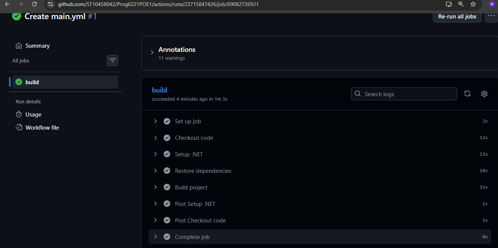

README FILE

Cybersecurity Awareness Chatbot

Project Overview

The Cybersecurity Awareness Chatbot is a console-based C# application designed to educate users about basic cybersecurity concepts. The chatbot interacts with users, answers questions, and provides safety tips on common cyber threats.

Features are:

-Interactive chatbot conversation
-ASCII art display using Figgle
-Voice playback feature using System.Media
-Personalized user interaction (uses user name)
-Keyword-based response system (OOP approach)
-Colored console output for better user experience
-Input validation
-30+ cybersecurity responses

-How to run the program

1. Open the project in Visual Studio
2. Build the solution
3. Run the program
4. Enter your name when prompted
5. Start asking cybersecurity-related questions

Example Questions

What is phishing?
How do I create a strong password?
What is malware?
What is ransomware?
How can I stay safe online?

Below is proof that the CI workflow runs successfully:

Reference list :

Figgle (2023) Figgle ASCII Text Generator Library. Available at: https://www.nuget.org/packages/Figgle/ (Accessed: 29 March 2026).

GeeksforGeeks (2024) C# String Methods and Validation. Available at: https://www.geeksforgeeks.org/ (Accessed: 29 March 2026).

Microsoft (2024) Console Class in C#. Available at: https://learn.microsoft.com/ (Accessed: 29 March 2026).

Microsoft (2024) SoundPlayer Class. Available at: https://learn.microsoft.com/ (Accessed: 29 March 2026).

Musley AI (2025) AI Voice Generator for WAV Audio Files. Available at: https://www.musley.ai/ (Accessed: 29 March 2026).

Patorjk (2025) Text to ASCII Art Generator. Available at: https://patorjk.com/software/taag/ (Accessed: 29 March 2026).

W3Schools (2024) C# Tutorial and String Handling. Available at: https://www.w3schools.com/cs/ (Accessed: 29 March 2026).

